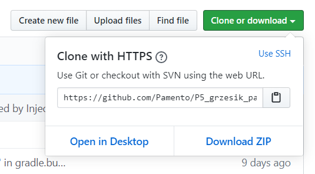
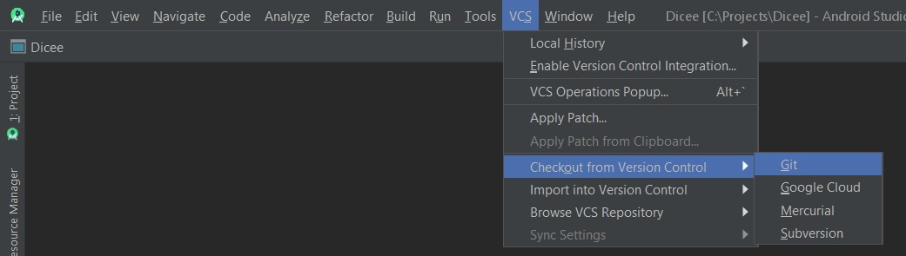
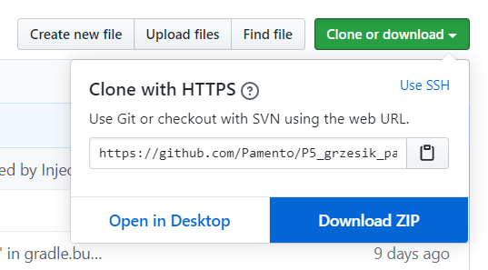
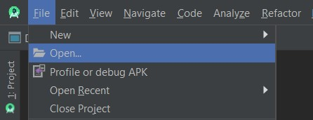
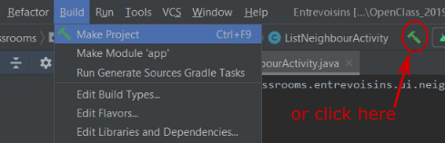
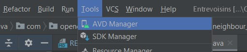

# Application : "ToDoc"

This project was generated with :
* [Android Studio](https://developer.android.com/studio) 4.0 ([Install](https://developer.android.com/studio/install) it if You need.)
* [Gradle](https://gradle.org/) version 5.6.4
* [Gradle plugin]() version 3.6.3
(You can check [on this link the compatibility](https://developer.android.com/studio/releases/gradle-plugin.html#updating-gradle) between Gradle and Gradle plugin). 
* You can find the remote repository at this address [https://github.com/Pamento/P5_grzesik_pawel](https://github.com/Pamento/P4_grzesik_pawel)

## Get the project on your computer ...

You can got it by cloning it, or by downloading the zip file,
such as we can see this proposition in the page of GitHub repository:

---
### 1. ... by cloning the repository from [**GitHub**](https://github.com/)

In Android Studio, use the function added in for this purpose.
The image below shows the way:

After following the instruction in the popup windows.

In case you need to add the git tool in your local device,
you can find some more information in [this page on StackOverflow](https://stackoverflow.com/questions/37093723/how-to-add-an-android-studio-project-to-github/44788350).

### 2. ... by downloading Zip file

After downloading zip file, you unZip it in the chosen folder and open it in Android Studio. 

___

## Open the project

By clicking on File->Open you get the project form folder created in the previous step.

___

## Build the project

When you want to see the simulated work done,
first, you build the project by clicking on the button, as you see below.
This step is optional as it can be run directly in, as shown below in the next step.
If your project was not build so far, it will built automatically when clicking 'run'.

___

## Run the project

  1. Add a Virtual Device Android
    
If you do not have any Android device,
create your emulator in AVD Manager.

___
For more information, please go to the official documentation: ['Build and run your app'](https://developer.android.com/studio/run)

  2. Run the project
    
By clicking the 'Run' button in Android Studio, you start your App simulation,
on the emulator of your choice.

___

Wen your work is done and meets everyone needs, publish your app.
Please, check the official site : ['Publish your app'](https://developer.android.com/studio/publish)
to learn how to build APK and publish it. 
